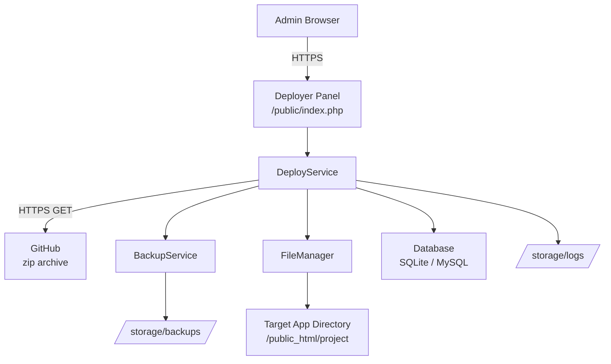
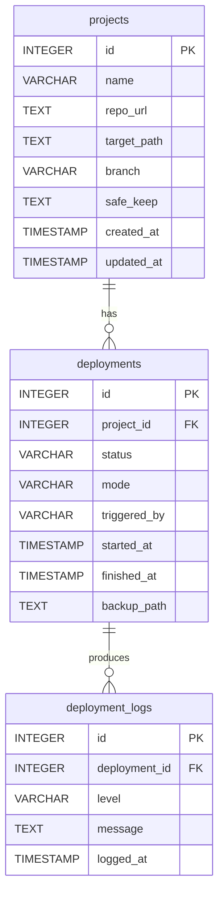

# TeraPH Web Deployer
## Software Requirements Specification (SRS)

---

**Document ID:** TPHA-SRS-001  
**Document Type:** Software Requirements Specification  
**Standard Reference:** IEEE 830 / ISO/IEC/IEEE 29148:2018  
**Project:** TeraPH Web Deployer  
**Status:** Draft  
**Version:** 1.0.0  
**Date:** 2026-04-21  
**Author:** TeraPH Development Team  

---

## Revision History

| Version | Date | Author | Description |
|---|---|---|---|
| 1.0.0 | 2026-04-21 | TeraPH Dev Team | Initial draft from concept specification |

---

## Table of Contents

1. [Introduction](#1-introduction)  
   1.1 [Purpose](#11-purpose)  
   1.2 [Scope](#12-scope)  
   1.3 [Definitions, Acronyms & Abbreviations](#13-definitions-acronyms--abbreviations)  
   1.4 [References](#14-references)  
   1.5 [Document Overview](#15-document-overview)  
2. [Overall Description](#2-overall-description)  
   2.1 [Product Perspective](#21-product-perspective)  
   2.2 [Product Functions Summary](#22-product-functions-summary)  
   2.3 [User Classes and Characteristics](#23-user-classes-and-characteristics)  
   2.4 [Operating Environment](#24-operating-environment)  
   2.5 [Design and Implementation Constraints](#25-design-and-implementation-constraints)  
   2.6 [Assumptions and Dependencies](#26-assumptions-and-dependencies)  
3. [System Features (Functional Requirements)](#3-system-features-functional-requirements)  
   3.1 [Authentication & Session Management](#31-authentication--session-management)  
   3.2 [Project Management](#32-project-management)  
   3.3 [Deployment Pipeline](#33-deployment-pipeline)  
   3.4 [Deployment Modes](#34-deployment-modes)  
   3.5 [Backup & Restore System](#35-backup--restore-system)  
   3.6 [Logging & Audit Trail](#36-logging--audit-trail)  
   3.7 [GitHub Integration](#37-github-integration)  
   3.8 [Dashboard & User Interface](#38-dashboard--user-interface)  
4. [External Interface Requirements](#4-external-interface-requirements)  
   4.1 [User Interfaces](#41-user-interfaces)  
   4.2 [Hardware Interfaces](#42-hardware-interfaces)  
   4.3 [Software Interfaces](#43-software-interfaces)  
   4.4 [Communication Interfaces](#44-communication-interfaces)  
5. [Non-Functional Requirements](#5-non-functional-requirements)  
   5.1 [Security Requirements](#51-security-requirements)  
   5.2 [Performance Requirements](#52-performance-requirements)  
   5.3 [Reliability & Availability](#53-reliability--availability)  
   5.4 [Maintainability](#54-maintainability)  
   5.5 [Portability](#55-portability)  
6. [Data Requirements](#6-data-requirements)  
   6.1 [Logical Data Model](#61-logical-data-model)  
   6.2 [Data Dictionary](#62-data-dictionary)  
   6.3 [Data Retention Policy](#63-data-retention-policy)  
7. [System Constraints & Restrictions](#7-system-constraints--restrictions)  
8. [Phase 2 — Future Requirements](#8-phase-2--future-requirements)  
9. [Appendix A — Requirement Traceability Matrix](#9-appendix-a--requirement-traceability-matrix)

---

## 1. Introduction

### 1.1 Purpose

This Software Requirements Specification (SRS) defines the complete functional and non-functional requirements for **TeraPH Web Deployer**, a self-hosted web deployment panel designed to operate on shared cPanel hosting environments. This document is intended for use by developers, architects, and stakeholders involved in the design, implementation, and testing of the system.

### 1.2 Scope

**TeraPH Web Deployer** (referred to hereafter as "the System" or "the Deployer") is a private, browser-accessible panel that enables authorized users to deploy registered web projects from GitHub to a target server directory. The system manages the entire deployment lifecycle — from source download to backup creation, file replacement, permission setting, and structured logging — with rollback capability at any point.

**In scope (Phase 1):**
- User authentication and session control
- Project registration and management
- Automated deployment pipeline (download → backup → replace → log)
- Two deployment modes: Safe Deploy and Full Deploy
- Pre-deployment backup with one-click restore
- Structured logging (database-backed with flat-file fallback)
- Minimal, single-page admin dashboard

**Out of scope (Phase 1):**
- GitHub webhook auto-triggering (Phase 2)
- Dry run / file diff viewer (Phase 2)
- Post-deployment notifications (Phase 2)
- Multi-user role management (Phase 2)
- CLI tooling

### 1.3 Definitions, Acronyms & Abbreviations

| Term | Definition |
|---|---|
| **Deployer** | The TeraPH Web Deployer application itself |
| **Project** | A registered web application with a defined GitHub repository and server target path |
| **Deployment** | A single execution of the deployment pipeline for a specific project |
| **Safe Deploy** | Deployment mode that preserves environment-specific files (`.env`, `uploads/`, etc.) |
| **Full Deploy** | Deployment mode that replaces the entire target directory |
| **Backup** | A timestamped zip archive of the target directory created before each deployment |
| **Pipeline** | The ordered sequence of automated steps comprising a deployment |
| **Lock** | A mutex mechanism preventing concurrent deployments for the same project |
| **Target Directory** | The server path where a project's files are served from (e.g., `/public_html/jongo`) |
| **cPanel** | A widely-used shared web hosting control panel |
| **PDO** | PHP Data Objects — the database abstraction layer used throughout the system |
| **CSRF** | Cross-Site Request Forgery — a web security attack mitigated by token validation |
| **SRS** | Software Requirements Specification |
| **REQ-F** | Functional Requirement identifier |
| **REQ-NF** | Non-Functional Requirement identifier |

### 1.4 References

| Reference | Document |
|---|---|
| TPHA-CONCEPT-001 | TeraPH Web Deployer — Concept & Architecture Specification v0.1.0 |
| IEEE 830-1998 | IEEE Recommended Practice for Software Requirements Specifications |
| ISO/IEC/IEEE 29148:2018 | Systems and software engineering — Life cycle processes — Requirements engineering |
| PHP Docs | https://www.php.net/manual |
| GitHub ZIP API | https://docs.github.com/en/rest/repos/contents |

### 1.5 Document Overview

- **Section 2** describes the product's context, users, environment, and constraints.
- **Section 3** contains all functional requirements, organized by system feature.
- **Section 4** specifies all external interface requirements.
- **Section 5** defines non-functional requirements (security, performance, reliability).
- **Section 6** defines the data model, data dictionary, and retention policies.
- **Section 7** lists hard constraints on the implementation.
- **Section 8** documents deferred Phase 2 requirements for future development.
- **Section 9** provides a Requirement Traceability Matrix.

---

## 2. Overall Description

### 2.1 Product Perspective

TeraPH Web Deployer is a standalone, self-contained web application. It does not depend on external CI/CD services, Git clients, or SSH access. It operates entirely within the cPanel hosting environment, accessing GitHub only via outbound HTTPS to download repository archives.



### 2.2 Product Functions Summary

| # | Function |
|---|---|
| F-01 | Authenticate and authorize the administrator |
| F-02 | Register, edit, and delete deployment projects |
| F-03 | Execute the deployment pipeline for a selected project |
| F-04 | Support Safe and Full deployment modes |
| F-05 | Create a timestamped backup before every deployment |
| F-06 | Restore a previous backup on demand |
| F-07 | Record structured, per-deployment logs |
| F-08 | Display deployment status and history on a single dashboard |

### 2.3 User Classes and Characteristics

#### 2.3.1 Administrator (Primary User)

- Has full access to all system functions
- Is a developer or site owner responsible for deployments
- Accesses the panel via a browser on any device
- Expected to understand basic web hosting concepts (file paths, branches, etc.)

#### 2.3.2 Viewer *(Phase 2)*

- Read-only access to deployment history and logs
- Cannot trigger deployments or manage projects

### 2.4 Operating Environment

| Component | Requirement |
|---|---|
| **Server OS** | Linux (any cPanel-supported distribution) |
| **Web Server** | Apache 2.4+ (with `.htaccess` and `mod_rewrite` support) |
| **PHP Version** | PHP 8.0 or higher |
| **PHP Extensions** | `pdo`, `pdo_sqlite` or `pdo_mysql`, `zip`, `curl`, `json`, `session` |
| **Hosting Type** | Shared cPanel hosting (no root/SSH access required) |
| **Database** | SQLite (file-based, default) or MySQL / MariaDB (optional upgrade) |
| **Outbound Network** | HTTPS access to `github.com` must be available from the server |
| **Browser** | Any modern browser supporting HTML5 and CSS3 (Chrome, Firefox, Safari, Edge) |

### 2.5 Design and Implementation Constraints

| ID | Constraint |
|---|---|
| CON-01 | The system MUST NOT require SSH, shell exec, or root-level privileges |
| CON-02 | No external PHP frameworks (Laravel, Symfony, etc.) may be used |
| CON-03 | All SQL queries MUST be written using PDO with named parameter binding |
| CON-04 | No SQLite-specific SQL constructs (`PRAGMA`, `AUTOINCREMENT`, `DATETIME('now')`) are permitted; the database engine must be swappable via DSN change only |
| CON-05 | The application must be deployable by uploading a zip to cPanel File Manager |
| CON-06 | Migrations must be non-destructive — schema changes may only `ADD COLUMN` to existing live tables |
| CON-07 | All dependencies must be bundleable without Composer (or Composer output committed) |
| CON-08 | No external CDN dependencies for core functionality (CDN links are acceptable for UI only) |

### 2.6 Assumptions and Dependencies

| ID | Assumption / Dependency |
|---|---|
| ASM-01 | The GitHub repositories being deployed are publicly accessible or accessible via a personal access token |
| ASM-02 | The server has write permissions on the `/deployer/storage/` and target project directories |
| ASM-03 | The `ZipArchive` PHP extension is available on the server |
| ASM-04 | `cURL` is enabled on the server for outbound HTTPS requests |
| ASM-05 | The administrator is responsible for correctly configuring project paths in `config.php` |
| ASM-06 | Only one deployment per project runs at a time; concurrent multi-project deployments are acceptable |

---

## 3. System Features (Functional Requirements)

> **Priority Scale:** `MUST` = mandatory for Phase 1 | `SHOULD` = high priority | `MAY` = optional enhancement

---

### 3.1 Authentication & Session Management

#### REQ-F-001 — Login Form
**Priority:** MUST  
The system MUST present a login form as the entry point. No other functionality is accessible without an active authenticated session.

#### REQ-F-002 — Credential Validation
**Priority:** MUST  
The system MUST validate credentials against a configurable username and bcrypt-hashed password stored in `config.php`. Plain-text password storage is not permitted.

#### REQ-F-003 — Session Establishment
**Priority:** MUST  
Upon successful login, the system MUST start a PHP session and store an authenticated flag. All subsequent page loads and action requests MUST verify the session flag before processing.

#### REQ-F-004 — Logout
**Priority:** MUST  
The system MUST provide a logout action that destroys the PHP session and redirects the user to the login form.

#### REQ-F-005 — Session Expiry
**Priority:** SHOULD  
The session SHOULD expire after a configurable idle timeout (default: 60 minutes), redirecting the user to the login form.

#### REQ-F-006 — Failed Login Feedback
**Priority:** MUST  
The system MUST display a generic error message on failed login ("Invalid credentials"). It MUST NOT reveal whether the username or password was incorrect.

---

### 3.2 Project Management

#### REQ-F-010 — Project Registration
**Priority:** MUST  
The system MUST allow the administrator to register a new project by providing:
- Project name (unique identifier)
- GitHub repository zip URL
- Target server directory (absolute path)
- Branch name (default: `main`)
- Safe-keep paths (comma-separated list of paths to preserve in Safe Deploy mode)

#### REQ-F-011 — Project Listing
**Priority:** MUST  
The dashboard MUST display all registered projects, each showing:
- Project name
- Last deployment timestamp (or "Never deployed")
- Last deployment status (Success / Failed / In Progress)

#### REQ-F-012 — Project Edit
**Priority:** SHOULD  
The system SHOULD allow the administrator to edit any project's configuration fields.

#### REQ-F-013 — Project Delete
**Priority:** SHOULD  
The system SHOULD allow the administrator to delete a project record. Deleting a project MUST NOT delete its associated backups or logs.

#### REQ-F-014 — Project Validation
**Priority:** MUST  
On save, the system MUST validate that:
- The project name is non-empty and does not conflict with an existing project
- The repo URL is a valid HTTPS URL
- The target path is a non-empty string

---

### 3.3 Deployment Pipeline

#### REQ-F-020 — Pipeline Trigger
**Priority:** MUST  
The system MUST allow the administrator to trigger a deployment for any registered project by selecting a deployment mode and confirming via a modal dialog.

#### REQ-F-021 — Deployment Lock
**Priority:** MUST  
Before executing any pipeline step, the system MUST acquire a deployment lock for the selected project. If a lock already exists, the system MUST reject the request and display an error message: "A deployment is already in progress for this project."

#### REQ-F-022 — Source Download
**Priority:** MUST  
The system MUST download the repository archive from GitHub using `cURL` and save it to `/storage/tmp/{project}_{timestamp}.zip`. The download MUST enforce a configurable timeout (default: 120 seconds).

#### REQ-F-023 — Archive Extraction
**Priority:** MUST  
The system MUST extract the downloaded zip archive to a temporary directory `/storage/tmp/{project}_{timestamp}/` using `ZipArchive`.

#### REQ-F-024 — Structure Validation
**Priority:** SHOULD  
After extraction, the system SHOULD verify that at least one expected file (configurable per project, e.g., `index.php`) exists in the extracted directory. If validation fails, the system MUST halt the pipeline and log an error.

#### REQ-F-025 — Pre-Deploy Backup
**Priority:** MUST  
The system MUST create a zip archive of the current target directory and store it at `/storage/backups/{project}_{timestamp}.zip` BEFORE any files are modified. If the backup step fails, the deployment MUST NOT proceed.

#### REQ-F-026 — Target Directory Clear
**Priority:** MUST  
The system MUST clear the target directory, applying mode-specific rules (see REQ-F-030 and REQ-F-031).

#### REQ-F-027 — File Move
**Priority:** MUST  
The system MUST recursively move all extracted files from the temporary directory into the cleaned target directory.

#### REQ-F-028 — Permission Setting
**Priority:** MUST  
After the file move, the system MUST set permissions:
- Directories: `0755`
- Files: `0644`
- Executable files (`.sh`, binary): `0755` (configurable)

#### REQ-F-029 — Lock Release & Log Finalization
**Priority:** MUST  
After the pipeline completes (success or failure), the system MUST:
1. Release the deployment lock
2. Write the final status and completion timestamp to the `deployments` table
3. Clean up the temporary extraction directory

---

### 3.4 Deployment Modes

#### REQ-F-030 — Safe Deploy Mode
**Priority:** MUST  
When mode is `safe`, the system MUST:
1. Move all paths listed in the project's `safe_keep` configuration aside before clearing the target
2. Clear the remaining target directory contents
3. Move new files into target
4. Restore the previously moved `safe_keep` paths to their original locations

Default preserved paths: `.env`, `uploads/`, `storage/`, `writable/`

#### REQ-F-031 — Full Deploy Mode
**Priority:** MUST  
When mode is `full`, the system MUST delete all contents of the target directory before writing new files. No paths are preserved.

#### REQ-F-032 — Mode Selection in UI
**Priority:** MUST  
The UI MUST require the user to explicitly select a mode (Safe / Full) before deploying. Safe Deploy MUST be the pre-selected default.

#### REQ-F-033 — Full Deploy Warning
**Priority:** MUST  
When Full Deploy is selected, the confirmation dialog MUST display a prominent warning indicating that all existing files, including `.env` and `uploads/`, will be permanently deleted.

---

### 3.5 Backup & Restore System

#### REQ-F-040 — Automatic Pre-Deploy Backup
**Priority:** MUST  
As defined in REQ-F-025, a backup MUST be created before every deployment. This requirement is non-negotiable.

#### REQ-F-041 — Backup Listing
**Priority:** MUST  
The system MUST list all available backups for a project, showing:
- Backup timestamp
- File size
- Associated deployment status

#### REQ-F-042 — Backup Restore
**Priority:** MUST  
The system MUST allow the administrator to restore any listed backup by:
1. Creating a backup of the current state (same as REQ-F-025) before restoring
2. Clearing the target directory
3. Extracting the selected backup zip into the target directory
4. Setting permissions (as per REQ-F-028)
5. Logging the restore action

#### REQ-F-043 — Backup Retention
**Priority:** SHOULD  
The system SHOULD retain the last N backups per project (configurable, default: 10) and automatically delete older backups beyond this limit.

#### REQ-F-044 — Backup Download
**Priority:** MAY  
The system MAY allow the administrator to download a backup zip directly from the browser.

---

### 3.6 Logging & Audit Trail

#### REQ-F-050 — Per-Step Logging
**Priority:** MUST  
Every step of the pipeline MUST produce a structured log entry with:
- Log level: `INFO`, `WARNING`, or `ERROR`
- Timestamp (UTC)
- Human-readable message

#### REQ-F-051 — Database Log Storage
**Priority:** MUST  
All log entries MUST be written to the `deployment_logs` table in the database (see Section 6) in real time (not batched).

#### REQ-F-052 — Flat File Log Fallback
**Priority:** MUST  
All log entries MUST also be appended to a flat text file at `/storage/logs/{project}_{deployment_id}.log` as a fallback in case the database is unavailable.

#### REQ-F-053 — Log Viewer
**Priority:** MUST  
The dashboard MUST allow the administrator to view all log entries for any past deployment, displayed in chronological order.

#### REQ-F-054 — Audit Trail
**Priority:** MUST  
Every deployment and restore action MUST record the following in the `deployments` table:
- Actor (logged-in username)
- Action type (deploy / restore)
- Project name
- Mode (safe / full)
- Start time and end time
- Outcome status (success / failed)
- Backup path used or created

---

### 3.7 GitHub Integration

#### REQ-F-060 — Zip Download URL Construction
**Priority:** MUST  
The system MUST construct the repository archive URL in the format:
```
https://github.com/{owner}/{repo}/archive/refs/heads/{branch}.zip
```
This avoids any dependency on Git binaries or SSH keys.

#### REQ-F-061 — Private Repository Support
**Priority:** SHOULD  
The system SHOULD support private repositories by accepting an optional GitHub Personal Access Token (PAT) per project, passed as an Authorization header in the cURL request.

#### REQ-F-062 — Download Error Handling
**Priority:** MUST  
If the download fails (network error, 404, 401, timeout), the system MUST halt the pipeline immediately, log a detailed error (including HTTP status code), and release the deployment lock.

---

### 3.8 Dashboard & User Interface

#### REQ-F-070 — Single-Page Dashboard
**Priority:** MUST  
All primary functions (project list, deploy, view logs, view backups) MUST be accessible from a single dashboard page without full page reloads for log and backup list views (JavaScript modal/panel preferred).

#### REQ-F-071 — Deploy Confirmation Modal
**Priority:** MUST  
Clicking "Deploy" MUST open a confirmation modal showing project name, selected mode, mode-specific warnings, and Confirm / Cancel buttons before pipeline execution begins.

#### REQ-F-072 — Real-Time Log Streaming
**Priority:** SHOULD  
During an active deployment, the UI SHOULD display log output in near real-time using polling (AJAX) or Server-Sent Events (SSE), so the administrator can observe pipeline progress without refreshing the page.

#### REQ-F-073 — Deployment Status Indicator
**Priority:** MUST  
Each project card on the dashboard MUST display a status badge:
- `● Live` (last deploy succeeded)
- `⚠ Failed` (last deploy failed)
- `⟳ In Progress` (deploy currently running)
- `○ Never deployed`

#### REQ-F-074 — Responsive Design
**Priority:** SHOULD  
The dashboard SHOULD be usable on mobile browsers without loss of core functionality.

---

## 4. External Interface Requirements

### 4.1 User Interfaces

- **Login Page:** A minimal centered form with username, password, and submit button.
- **Dashboard:** A project card list with last deployment info and action buttons per project.
- **Modals:** Deploy confirmation, log viewer, backup list — all rendered in-page without navigation.
- **UI Framework:** Bootstrap 5 (loaded via CDN). No custom UI framework.
- **Typography:** System font stack preferred; no mandatory web font dependency.

### 4.2 Hardware Interfaces

The system has no direct hardware interface requirements. It runs as standard PHP on a web server.

### 4.3 Software Interfaces

| Interface | Details |
|---|---|
| **PHP 8.0+** | Core runtime environment |
| **PDO + pdo_sqlite / pdo_mysql** | Database abstraction for all persistence operations |
| **PHP ZipArchive** | Archive creation (backups) and extraction (deployment) |
| **PHP cURL** | Outbound HTTPS requests to GitHub |
| **GitHub HTTPS API** | Source archive download — no authentication for public repos |
| **Apache .htaccess** | Directory access restriction for `/storage`, `/app`, `config.php` |

### 4.4 Communication Interfaces

| Protocol | Usage |
|---|---|
| HTTPS (outbound) | Downloading repository zip archives from GitHub |
| HTTP/HTTPS (inbound) | Admin browser accessing the panel |
| HTTPS (inbound, Phase 2) | GitHub webhook POST requests to `/public/webhook.php` |

---

## 5. Non-Functional Requirements

### 5.1 Security Requirements

#### REQ-NF-001 — Authentication Enforcement
**Priority:** MUST  
Every request to any page or action endpoint MUST verify an active authenticated session. Unauthenticated requests MUST be redirected to the login page.

#### REQ-NF-002 — CSRF Protection
**Priority:** MUST  
All state-changing actions (deploy, restore, delete project) MUST be protected by a CSRF token. The token MUST be validated server-side on every submission.

#### REQ-NF-003 — Storage Directory Restriction
**Priority:** MUST  
The `/storage`, `/app` directories and `config.php` MUST be protected by `.htaccess` rules to prevent direct browser access.

#### REQ-NF-004 — Password Hashing
**Priority:** MUST  
Administrator passwords MUST be stored as bcrypt hashes. The system MUST use `password_hash()` and `password_verify()` for credential management.

#### REQ-NF-005 — No Arbitrary File Operations
**Priority:** MUST  
The system MUST only operate on directories registered in the projects table. No operation may target an arbitrary path supplied by user input.

#### REQ-NF-006 — Input Sanitization
**Priority:** MUST  
All user-supplied input rendered in HTML output MUST be escaped using `htmlspecialchars()`. All database inputs MUST use PDO prepared statements.

#### REQ-NF-007 — Webhook Token Validation *(Phase 2 prep)*
**Priority:** MUST  
The `/public/webhook.php` endpoint MUST validate an HMAC-SHA256 signature or a shared secret token before processing any payload.

---

### 5.2 Performance Requirements

#### REQ-NF-010 — Dashboard Load Time
**Priority:** SHOULD  
The dashboard MUST load in under 2 seconds on a standard shared hosting server under normal conditions (< 20 registered projects).

#### REQ-NF-011 — Deployment Execution Time
**Priority:** SHOULD  
The deployment pipeline (excluding download time) MUST complete within 60 seconds for project directories up to 500 MB in size.

#### REQ-NF-012 — Download Timeout
**Priority:** MUST  
The cURL download request MUST enforce a maximum timeout of 120 seconds. If exceeded, the pipeline MUST halt and log a timeout error.

#### REQ-NF-013 — Concurrent Project Deployments
**Priority:** SHOULD  
The system SHOULD support concurrent deployments across different projects. A lock mechanism per project (not global) MUST prevent double-execution of the same project only.

---

### 5.3 Reliability & Availability

#### REQ-NF-020 — Atomic Deployment
**Priority:** MUST  
A deployment MUST be treated as an atomic operation. If any pipeline step fails after the backup has been created (steps 3–8), the system MUST log the failure clearly and leave the target directory in its pre-failure state (i.e., the backup was already taken and can be manually restored).

#### REQ-NF-021 — Lock Auto-Release
**Priority:** MUST  
If a deployment crashes unexpectedly (fatal PHP error, server timeout), a stale lock MUST be auto-released after a configurable timeout (default: 10 minutes) via timestamp-based lock expiry.

#### REQ-NF-022 — Log Fallback
**Priority:** MUST  
As specified in REQ-F-052, flat-file logs MUST be written alongside database logs to ensure audit trail availability even under database failure.

---

### 5.4 Maintainability

#### REQ-NF-030 — Service Layer Architecture
**Priority:** MUST  
Business logic MUST be encapsulated in dedicated service classes (`DeployService`, `BackupService`, `FileManager`, `GitHubService`). No business logic may exist directly in `index.php`, `deploy.php`, or other public entry points.

#### REQ-NF-031 — Code Comments
**Priority:** SHOULD  
All public methods in service classes SHOULD include PHPDoc block comments describing parameters, return types, and thrown exceptions.

#### REQ-NF-032 — Configuration Centralization
**Priority:** MUST  
All environment-specific values (credentials, paths, database DSN, timeouts) MUST be defined in `config.php`. No hardcoded values are permitted within service classes.

#### REQ-NF-033 — Non-Destructive Migrations
**Priority:** MUST  
Database schema changes applied to a live system MUST only add new columns or tables. Existing columns MUST NOT be renamed, retyped, or dropped in a migration.

---

### 5.5 Portability

#### REQ-NF-040 — Database Portability
**Priority:** MUST  
The system MUST be operable with either SQLite or MySQL/MariaDB. The database engine is selected by changing the DSN in `Database.php`. No SQL specific to SQLite or MySQL may be used in model or service code.

#### REQ-NF-041 — Hosting Portability
**Priority:** MUST  
The application MUST be deployable to any standard cPanel shared hosting environment by uploading the application files. No server-level configuration changes (php.ini, Apache vhost) should be required for basic operation.

---

## 6. Data Requirements

### 6.1 Logical Data Model



### 6.2 Data Dictionary

#### Table: `projects`

| Column | Type | Nullable | Default | Description |
|---|---|---|---|---|
| `id` | INTEGER | NO | (auto) | Primary key |
| `name` | VARCHAR(100) | NO | — | Unique project identifier |
| `repo_url` | TEXT | NO | — | Full GitHub zip archive URL |
| `target_path` | TEXT | NO | — | Absolute server deploy path |
| `branch` | VARCHAR(50) | NO | `main` | GitHub branch name |
| `safe_keep` | TEXT | YES | NULL | JSON array of preserved paths in Safe Deploy |
| `created_at` | TIMESTAMP | NO | CURRENT\_TIMESTAMP | Record creation time |
| `updated_at` | TIMESTAMP | YES | NULL | Last modification time |

#### Table: `deployments`

| Column | Type | Nullable | Default | Description |
|---|---|---|---|---|
| `id` | INTEGER | NO | (auto) | Primary key |
| `project_id` | INTEGER | NO | — | Foreign key → `projects.id` |
| `status` | VARCHAR(20) | NO | `pending` | `pending`, `running`, `success`, `failed` |
| `mode` | VARCHAR(10) | NO | `safe` | `safe` or `full` |
| `triggered_by` | VARCHAR(100) | NO | — | Username of the initiating administrator |
| `started_at` | TIMESTAMP | NO | CURRENT\_TIMESTAMP | Pipeline start time |
| `finished_at` | TIMESTAMP | YES | NULL | Pipeline end time (NULL if still running) |
| `backup_path` | TEXT | YES | NULL | Path to the pre-deploy backup archive |

#### Table: `deployment_logs`

| Column | Type | Nullable | Default | Description |
|---|---|---|---|---|
| `id` | INTEGER | NO | (auto) | Primary key |
| `deployment_id` | INTEGER | NO | — | Foreign key → `deployments.id` |
| `level` | VARCHAR(10) | NO | — | `INFO`, `WARNING`, `ERROR` |
| `message` | TEXT | NO | — | Human-readable log message |
| `logged_at` | TIMESTAMP | NO | CURRENT\_TIMESTAMP | Entry timestamp (UTC) |

### 6.3 Data Retention Policy

| Data Type | Retention Rule |
|---|---|
| **Project records** | Retained indefinitely; deleted only by explicit admin action |
| **Deployment records** | Retained indefinitely for full audit trail |
| **Deployment log entries** | Retained indefinitely in database; flat files may be pruned after 90 days |
| **Backup zip files** | Last N per project (default: 10); older backups auto-deleted |
| **Temporary extraction files** | Deleted immediately after deployment pipeline completes (success or failure) |

---

## 7. System Constraints & Restrictions

| ID | Constraint |
|---|---|
| CON-01 | No SSH, shell_exec, exec, or system() calls. The system operates entirely via PHP file functions and ZipArchive. |
| CON-02 | No external PHP framework may be introduced as a dependency. |
| CON-03 | All SQL MUST use PDO named parameters. String interpolation in SQL queries is strictly forbidden. |
| CON-04 | SQLite-specific SQL constructs MUST NOT be used in any query. Portability to MySQL/MariaDB via DSN change alone is a hard requirement. |
| CON-05 | The deployer MUST NOT perform any operation on paths not registered as an active project target. |
| CON-06 | Database migrations MUST be additive only. Destructive migrations (`DROP COLUMN`, `RENAME COLUMN`) are not permitted on live systems. |
| CON-07 | All configuration (passwords, paths, tokens) MUST reside in `config.php` and MUST NOT be committed to a public version control repository. A `config.php.example` template MUST be provided instead. |

---

## 8. Phase 2 — Future Requirements

These requirements are recorded for planning purposes but are explicitly excluded from Phase 1.

| ID | Feature | Description |
|---|---|---|
| REQ-P2-001 | GitHub Webhook | Receive POST webhook from GitHub on push event; validate HMAC-SHA256 signature; trigger deploy automatically |
| REQ-P2-002 | Dry Run Mode | Execute all pipeline steps except file write and target clear; output a list of files that would be added, modified, or deleted |
| REQ-P2-003 | File Diff Viewer | Compare file contents between the current deployed version and the incoming release archive |
| REQ-P2-004 | Email Notifications | Send configurable notification email on deployment success or failure via SMTP or PHP `mail()` |
| REQ-P2-005 | Telegram Notifications | Send deployment status message to a configured Telegram Bot API endpoint |
| REQ-P2-006 | Viewer Role | Add a read-only user role with login access to view deployment history and logs only |
| REQ-P2-007 | IP Whitelist | Restrict panel access to a configurable list of IP addresses |
| REQ-P2-008 | Login Rate Limiting | Lock account or introduce delay after N consecutive failed login attempts |

---

## 9. Appendix A — Requirement Traceability Matrix

| Req ID | Description | Section | Priority | Phase |
|---|---|---|---|---|
| REQ-F-001 | Login form | 3.1 | MUST | 1 |
| REQ-F-002 | Credential validation (bcrypt) | 3.1 | MUST | 1 |
| REQ-F-003 | Session establishment | 3.1 | MUST | 1 |
| REQ-F-004 | Logout | 3.1 | MUST | 1 |
| REQ-F-005 | Session expiry | 3.1 | SHOULD | 1 |
| REQ-F-006 | Failed login feedback (generic) | 3.1 | MUST | 1 |
| REQ-F-010 | Project registration | 3.2 | MUST | 1 |
| REQ-F-011 | Project listing on dashboard | 3.2 | MUST | 1 |
| REQ-F-012 | Project edit | 3.2 | SHOULD | 1 |
| REQ-F-013 | Project delete | 3.2 | SHOULD | 1 |
| REQ-F-014 | Project input validation | 3.2 | MUST | 1 |
| REQ-F-020 | Pipeline trigger | 3.3 | MUST | 1 |
| REQ-F-021 | Deployment lock | 3.3 | MUST | 1 |
| REQ-F-022 | Source download | 3.3 | MUST | 1 |
| REQ-F-023 | Archive extraction | 3.3 | MUST | 1 |
| REQ-F-024 | Structure validation | 3.3 | SHOULD | 1 |
| REQ-F-025 | Pre-deploy backup | 3.3 | MUST | 1 |
| REQ-F-026 | Target directory clear | 3.3 | MUST | 1 |
| REQ-F-027 | File move to target | 3.3 | MUST | 1 |
| REQ-F-028 | Permission setting | 3.3 | MUST | 1 |
| REQ-F-029 | Lock release & log finalization | 3.3 | MUST | 1 |
| REQ-F-030 | Safe deploy mode | 3.4 | MUST | 1 |
| REQ-F-031 | Full deploy mode | 3.4 | MUST | 1 |
| REQ-F-032 | Mode selection in UI | 3.4 | MUST | 1 |
| REQ-F-033 | Full deploy warning dialog | 3.4 | MUST | 1 |
| REQ-F-040 | Automatic pre-deploy backup | 3.5 | MUST | 1 |
| REQ-F-041 | Backup listing | 3.5 | MUST | 1 |
| REQ-F-042 | Backup restore | 3.5 | MUST | 1 |
| REQ-F-043 | Backup retention limit | 3.5 | SHOULD | 1 |
| REQ-F-044 | Backup download | 3.5 | MAY | 1 |
| REQ-F-050 | Per-step logging | 3.6 | MUST | 1 |
| REQ-F-051 | Database log storage | 3.6 | MUST | 1 |
| REQ-F-052 | Flat file log fallback | 3.6 | MUST | 1 |
| REQ-F-053 | Log viewer in UI | 3.6 | MUST | 1 |
| REQ-F-054 | Audit trail record | 3.6 | MUST | 1 |
| REQ-F-060 | Zip URL construction | 3.7 | MUST | 1 |
| REQ-F-061 | Private repo support (PAT) | 3.7 | SHOULD | 1 |
| REQ-F-062 | Download error handling | 3.7 | MUST | 1 |
| REQ-F-070 | Single-page dashboard | 3.8 | MUST | 1 |
| REQ-F-071 | Confirmation modal | 3.8 | MUST | 1 |
| REQ-F-072 | Real-time log streaming | 3.8 | SHOULD | 1 |
| REQ-F-073 | Status indicator badges | 3.8 | MUST | 1 |
| REQ-F-074 | Responsive design | 3.8 | SHOULD | 1 |
| REQ-NF-001 | Authentication enforcement | 5.1 | MUST | 1 |
| REQ-NF-002 | CSRF protection | 5.1 | MUST | 1 |
| REQ-NF-003 | Storage directory restriction | 5.1 | MUST | 1 |
| REQ-NF-004 | Password hashing (bcrypt) | 5.1 | MUST | 1 |
| REQ-NF-005 | No arbitrary file operations | 5.1 | MUST | 1 |
| REQ-NF-006 | Input sanitization | 5.1 | MUST | 1 |
| REQ-NF-007 | Webhook token validation | 5.1 | MUST | 2 |
| REQ-NF-010 | Dashboard load time < 2s | 5.2 | SHOULD | 1 |
| REQ-NF-011 | Pipeline time < 60s | 5.2 | SHOULD | 1 |
| REQ-NF-012 | Download timeout enforcement | 5.2 | MUST | 1 |
| REQ-NF-013 | Per-project concurrent locks | 5.2 | SHOULD | 1 |
| REQ-NF-020 | Atomic deployment | 5.3 | MUST | 1 |
| REQ-NF-021 | Stale lock auto-release | 5.3 | MUST | 1 |
| REQ-NF-022 | Log fallback | 5.3 | MUST | 1 |
| REQ-NF-030 | Service layer architecture | 5.4 | MUST | 1 |
| REQ-NF-031 | PHPDoc comments | 5.4 | SHOULD | 1 |
| REQ-NF-032 | Centralized configuration | 5.4 | MUST | 1 |
| REQ-NF-033 | Non-destructive migrations | 5.4 | MUST | 1 |
| REQ-NF-040 | Database portability (PDO) | 5.5 | MUST | 1 |
| REQ-NF-041 | Hosting portability (cPanel) | 5.5 | MUST | 1 |

---

*End of Document — TPHA-SRS-001 v1.0.0*
