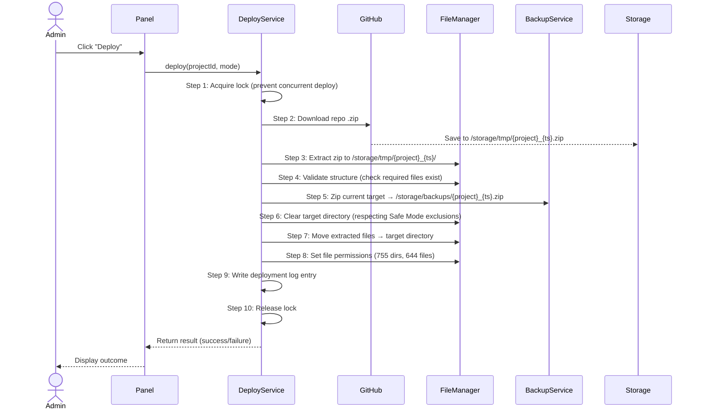

# TeraPH Web Deployer — Software Concept & Architecture Specification

**Document Type:** Concept & Architecture Specification  
**Status:** Draft  
**Version:** 0.1.0  
**Date:** 2026-04-21

---

## Table of Contents

1. [Introduction & Problem Statement](#1-introduction--problem-statement)
2. [Core Philosophy](#2-core-philosophy)
3. [System Architecture](#3-system-architecture)
4. [Data Layer](#4-data-layer)
5. [Core Features & Workflows](#5-core-features--workflows)
6. [Deployment Modes](#6-deployment-modes)
7. [User Interface Design](#7-user-interface-design)
8. [Security Model](#8-security-model)
9. [Error Handling & Logging](#9-error-handling--logging)
10. [Future Roadmap (Phase 2)](#10-future-roadmap-phase-2)

---

## 1. Introduction & Problem Statement

**TeraPH Web Deployer** is a self-hosted, lightweight deployment panel designed to run on standard cPanel shared hosting environments. It provides a controlled, auditable mechanism for pushing web application updates — without requiring SSH access, a CI/CD pipeline, or any external DevOps infrastructure.

### Problem Being Solved

| Challenge | Impact |
|---|---|
| No SSH access on shared hosting | Cannot use Git or shell-based deploy scripts |
| Manual FTP/SFTP file uploads are slow and error-prone | High risk during live updates |
| No rollback mechanism after a bad deploy | Downtime is unrecoverable without a backup strategy |
| Undocumented deployments | No audit trail for "who deployed what and when" |

### Solution

A private, password-protected deploy panel hosted within the cPanel account. Authorized users open a URL, select a registered project, and trigger a structured deployment. The system automates backups, file replacement, permission setting, and logging — with the ability to restore a previous version at any time.

> This tool is practically a "push to production" button with safeguards built in.

---

## 2. Core Philosophy

Deployments must be:

- **Traceable** — Every deployment is logged with actor, timestamp, and outcome.
- **Reversible** — A backup is taken before every deployment, allowing one-click rollback.
- **Controlled** — Only registered projects can be deployed. No arbitrary file operations.
- **Atomic** — A deployment either fully succeeds or rolls back; no half-applied states.

This establishes the primary data model:

```
Projects → Deployments → Logs
                    ↓
                 Backups
```

---

## 3. System Architecture

### 3.1 Directory Structure

```
/deployer
├── app/
│   ├── Services/
│   │   ├── DeployService.php       # Orchestrates the full deploy pipeline
│   │   ├── BackupService.php       # Handles pre-deploy zipping and restore
│   │   ├── GitHubService.php       # Downloads repo zip from GitHub
│   │   └── FileManager.php         # Extracts, moves, sets permissions
│   ├── Models/
│   │   ├── Project.php
│   │   ├── Deployment.php
│   │   └── Log.php
│   └── Database.php                # PDO connection factory (DB-agnostic)
├── storage/
│   ├── tmp/                        # Temporary zip extractions (auto-cleaned)
│   ├── backups/                    # Timestamped backups per project
│   └── logs/                       # Per-deployment log files
├── public/
│   ├── index.php                   # Main dashboard
│   ├── deploy.php                  # Deploy action endpoint
│   └── webhook.php                 # GitHub webhook receiver (Phase 2)
├── config.php                      # Projects, paths, credentials
└── .htaccess                       # Access restriction rules
```

### 3.2 High-Level Architecture

```mermaid
graph TD
    A[Admin Browser] -->|HTTPS| B[/public/index.php Dashboard/]
    B -->|Trigger Deploy| C[DeployService]
    C --> D[GitHubService\nDownload .zip]
    C --> E[BackupService\nZip current version]
    C --> F[FileManager\nExtract + Move + Chmod]
    D -->|zip saved to| G[/storage/tmp/]
    E -->|backup saved to| H[/storage/backups/]
    F -->|writes to| I[Target App Directory\ne.g. /public_html/jongo]
    C -->|writes| J[/storage/logs/]
    K[GitHub\nWebhook] -->|Phase 2| L[/public/webhook.php]
    L --> C
```

### 3.3 Technology Stack

| Component | Technology | Rationale |
|---|---|---|
| Backend | PHP (no framework) | Maximum cPanel compatibility |
| UI | HTML + Bootstrap 5 | Minimal dependencies, responsive |
| HTTP Client | PHP cURL | Native, no external libraries needed |
| Archive Operations | PHP `ZipArchive` | Native zip support for backups & extraction |
| Database | PDO (SQLite default, MySQL-ready) | Portable; see Section 4 |
| Source Code | GitHub (zip download) | Avoids Git/SSH dependency on shared hosting |

---

## 4. Data Layer

### 4.1 Database Abstraction

All database interactions **must** use PHP PDO with named parameter binding. No SQLite-specific constructs (e.g., `PRAGMA`, `AUTOINCREMENT`, `DATETIME('now')`) are permitted in queries. This ensures the database engine can be switched from SQLite to MySQL/MariaDB by changing the DSN string in `Database.php` alone.

```php
// Database.php — DB-agnostic PDO factory
class Database {
    private static ?PDO $instance = null;

    public static function connect(): PDO {
        if (self::$instance === null) {
            // DSN is the ONLY environment-specific value
            $dsn = DB_DRIVER === 'mysql'
                ? 'mysql:host=' . DB_HOST . ';dbname=' . DB_NAME . ';charset=utf8mb4'
                : 'sqlite:' . DB_PATH;

            self::$instance = new PDO($dsn, DB_USER, DB_PASS, [
                PDO::ATTR_ERRMODE            => PDO::ERRMODE_EXCEPTION,
                PDO::ATTR_DEFAULT_FETCH_MODE => PDO::FETCH_ASSOC,
                PDO::ATTR_EMULATE_PREPARES   => false,
            ]);
        }
        return self::$instance;
    }
}
```

### 4.2 Schema

```sql
CREATE TABLE IF NOT EXISTS projects (
    id          INTEGER PRIMARY KEY,
    name        VARCHAR(100)  NOT NULL UNIQUE,
    repo_url    TEXT          NOT NULL,
    target_path TEXT          NOT NULL,
    branch      VARCHAR(50)   NOT NULL DEFAULT 'main',
    created_at  TIMESTAMP     NOT NULL DEFAULT CURRENT_TIMESTAMP
);

CREATE TABLE IF NOT EXISTS deployments (
    id          INTEGER PRIMARY KEY,
    project_id  INTEGER       NOT NULL REFERENCES projects(id),
    status      VARCHAR(20)   NOT NULL DEFAULT 'pending',
    mode        VARCHAR(10)   NOT NULL DEFAULT 'safe',
    triggered_by VARCHAR(100) NOT NULL,
    started_at  TIMESTAMP     NOT NULL DEFAULT CURRENT_TIMESTAMP,
    finished_at TIMESTAMP     NULL,
    backup_path TEXT          NULL
);

CREATE TABLE IF NOT EXISTS deployment_logs (
    id             INTEGER PRIMARY KEY,
    deployment_id  INTEGER  NOT NULL REFERENCES deployments(id),
    level          VARCHAR(10) NOT NULL,
    message        TEXT        NOT NULL,
    logged_at      TIMESTAMP   NOT NULL DEFAULT CURRENT_TIMESTAMP
);
```

> **Note:** Use the project's migration facility (when implemented) to apply schema changes. Never modify a live table destructively — only `ADD COLUMN` operations are permitted in migrations applied to a live system.

---

## 5. Core Features & Workflows

### 5.1 Project Management

Projects are registered entities, not arbitrary upload targets. Each project record defines a deployment contract.

**Project fields:**

| Field | Type | Description |
|---|---|---|
| `name` | `string` | Human-readable identifier (e.g., `jongo-erp`) |
| `repo_url` | `string` | GitHub zip URL for the target branch |
| `target_path` | `string` | Absolute server path (e.g., `/home/user/public_html/jongo`) |
| `branch` | `string` | Target branch name (default: `main`) |

**Example configuration:**

```php
// config.php
$projects = [
    'jongo' => [
        'repo'   => 'https://github.com/teraph/jongo/archive/refs/heads/main.zip',
        'path'   => '/home/user/public_html/jongo',
        'branch' => 'main',
    ],
    'restou' => [
        'repo'   => 'https://github.com/teraph/restou/archive/refs/heads/main.zip',
        'path'   => '/home/user/public_html/restou',
        'branch' => 'main',
    ],
];
```

---

### 5.2 Deployment Pipeline

The deploy pipeline is a sequential, transactional process. Each step must succeed before the next begins. On any failure, the pipeline halts, logs the error, and (where applicable) triggers rollback.



---

## 6. Deployment Modes

Two modes are supported to accommodate different use cases:

### 6.1 Full Deploy

Replaces the entire target directory with the new version.

- **Use case:** Initial deploys, major version upgrades, clean slates.
- **Behaviour:** All files in the target directory are deleted before new files are written.
- **Risk:** Will overwrite `.env`, `uploads/`, and any runtime-generated files.

### 6.2 Safe Deploy *(default)*

Replaces application code while preserving environment-specific files.

- **Use case:** Routine updates to a live application.
- **Preserved paths (configurable per project):**

```php
'safe_keep' => ['.env', 'uploads/', 'storage/', 'writable/'],
```

- **Behaviour:** Listed paths are moved aside before the target is cleared, then restored after new files are moved in.

> **Recommendation:** Safe Deploy should be the default mode. Full Deploy should require an explicit confirmation dialog.

---

## 7. User Interface Design

### 7.1 Dashboard Layout

The panel is a single-page dashboard. No multi-page navigation is required for Phase 1.

```
┌─────────────────────────────────────────────────────────────────┐
│  TeraPH Deployer                              [Logout]           │
├─────────────────────────────────────────────────────────────────┤
│  PROJECTS                                                        │
│                                                                  │
│  ┌──────────────────────────────────────────────────────────┐    │
│  │  Jongo ERP           ● Live   Last Deploy: 2h ago        │    │
│  │                      [Deploy ▼]  [Logs]  [Backups]       │    │
│  └──────────────────────────────────────────────────────────┘    │
│                                                                  │
│  ┌──────────────────────────────────────────────────────────┐    │
│  │  Restou App          ● Live   Last Deploy: 1 day ago     │    │
│  │                      [Deploy ▼]  [Logs]  [Backups]       │    │
│  └──────────────────────────────────────────────────────────┘    │
└─────────────────────────────────────────────────────────────────┘
```

### 7.2 User Actions

| Action | Behaviour |
|---|---|
| **Deploy** | Dropdown to select mode (Safe / Full) → Confirmation dialog → Pipeline executes with live log stream |
| **View Logs** | Expandable log viewer showing all entries for the last deployment |
| **Backups** | Lists timestamped backups for the project with a **Restore** button per entry |

### 7.3 Deploy Confirmation Dialog

Before any deployment runs, a modal must display:

- Project name
- Selected mode (Safe / Full)
- A warning if Full Deploy is selected
- **Confirm** and **Cancel** buttons

---

## 8. Security Model

> [!CAUTION]
> This panel has full file-system read/write access on the server. It must be locked down accordingly.

### 8.1 Phase 1 (Minimum Viable Security)

| Control | Implementation |
|---|---|
| Authentication | Password login with PHP session management |
| Action tokens | CSRF token per form/action to prevent cross-site request forgery |
| Directory access | `.htaccess` `Deny from all` on `/storage`, `/app`, `config.php` |
| Webhook authentication | Secret token validated on every incoming webhook request |

### 8.2 Phase 2 (Hardened)

| Control | Description |
|---|---|
| IP Whitelist | Allow panel access only from known IP addresses |
| Rate limiting | Limit failed login attempts (lockout after N failures) |
| Audit log | All logins, deploys, and restores recorded with IP and timestamp |
| HTTPS enforcement | Redirect all HTTP requests to HTTPS via `.htaccess` |

---

## 9. Error Handling & Logging

### 9.1 Principles

- **Never fail silently.** Every operation must have a success or failure path.
- **Log everything.** Each pipeline step produces a structured log entry.
- **Atomic writes.** Log entries are written in real time, not buffered, so partial failures are fully traceable.

### 9.2 Log Format

```
[2026-04-21 18:32:14] [INFO]    Deployment started for project: jongo (mode: safe)
[2026-04-21 18:32:15] [INFO]    Lock acquired
[2026-04-21 18:32:17] [INFO]    Downloaded archive: 2.4 MB in 2.1s
[2026-04-21 18:32:18] [INFO]    Extracted to /storage/tmp/jongo_20260421_183218/
[2026-04-21 18:32:18] [INFO]    Structure validation passed
[2026-04-21 18:32:20] [INFO]    Backup created: /storage/backups/jongo_20260421_183218.zip
[2026-04-21 18:32:21] [ERROR]   Failed to delete /public_html/jongo/cache — Permission denied
[2026-04-21 18:32:21] [INFO]    Deployment halted. Lock released.
```

### 9.3 Log Storage

- Logs are stored both in the database (`deployment_logs` table) and as flat text files in `/storage/logs/`.
- Flat files serve as a fallback in the event of a database failure during deployment.

---

## 10. Future Roadmap (Phase 2)

These features are scoped for a second release after the core pipeline is stable.

### 10.1 GitHub Webhook Auto-Deploy

Connect projects to GitHub's webhook system for commit-triggered deployments.

```
Push to branch → GitHub fires POST →
/deployer/public/webhook.php?project=jongo&token=SECRET →
DeployService::deploy()
```

### 10.2 Dry Run Mode

Before committing a deploy, output a diff showing exactly which files will be added, modified, or removed. No changes are made to the target directory.

```
[DRY RUN] Would add:    app/Services/NewService.php
[DRY RUN] Would modify: config/database.php
[DRY RUN] Would delete: app/OldService.php
```

### 10.3 File Diff Viewer

An in-panel viewer to compare the current deployed version against the incoming release, highlighting changed files.

### 10.4 Notifications

Post-deployment notifications sent via:

- Email (PHP `mail()` or SMTP)
- Telegram Bot API

Notification payload includes: project name, deploy mode, status (success/failure), timestamp, and a link to the deployment log.

### 10.5 Multi-User Access

Role-based access with at least two roles:

| Role | Permissions |
|---|---|
| **Admin** | Full access: manage projects, deploy, restore, view logs |
| **Viewer** | Read-only: view deployment history and logs |

---

*End of Document — TeraPH Web Deployer Concept & Architecture Specification v0.1.0*
